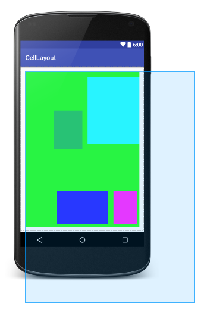
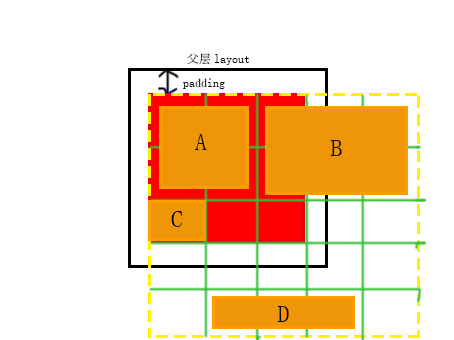

# CellLayout
课程表般网格layout  

效果图如下：  

说明图如下：  

## Feasures

* parent layout不受CellLayout控制，所以parent的padding由父类决定
* CellLayout支持padding
* 支持每个cell的margin
* CellLayout的layout\_width和layout\_height要用match_parent
* 忽略其中每个cell的layout\_width和layout\_height，内部一视同仁wrap_content，width和height由cell\_column\_count和cell\_row\_count决定

## Attributes

**CellLayout**

* cell\_row\_count  —— 总行数  
* cell\_column\_count —— 总列数
* cell\_row\_visible —— 在父类的窗口中，能够一次性显示的行数
* cell\_column\_visible —— 在父类的窗口中，能够一次性显示的列数

因为一次显示的大小有限，而且一些类似ScrollView的，滑动的话需要超过parent大小的存在。所以定义了四个属性，cell\_XX\_count和cell\_XX\_visible。    
visible：代表着，parent的大小状态下，一次显示多少行、列    
count: 代表着，实际大小，共有多少行、列   
在上面的说明图中，绿色网格线不存在，只为了表示网格。    
红色矩形框，代表着parent一开始决定给CellLayout的大小，一般情况下，就是parent的大小。如图所示，有3\*3大小，这也是cell\_row\_visible和cell\_column\_visible的大小。  
黄色虚线所包括的区域，5\*5大小，就是实际上CellLayout的大小，cell\_row\_count和cell\_column\_count的大小。    

例如在上面的说明图中
	
		app:cell_column_count="5"
	    app:cell_column_visible="3"
	    app:cell_row_count="5"
	    app:cell_row_visible="3"

**CellLayout LayoutParams**

* cell\_row —— 起始所在行，0 index
* cell\_column —— 起始所在列，0 index
* cell\_row\_count —— 所占行数 
* cell\_column\_count —— 所占列数

每个cell支持margin属性，方便缩进之类的。  
cell\_row和cell\_count是0索引起始的，和数组的下标起始保持一致。  

例如在上面的说明图中

	A方块
		android:layout_margin="8dp"
		app:cell_column="0"
        app:cell_column_count="2"
        app:cell_row="0"
        app:cell_row_count="2"

	B方块
		android:layout_margin="8dp"
		app:cell_column="2"
        app:cell_column_count="3"
        app:cell_row="0"
        app:cell_row_count="2"
	
	C方块
		android:layout_margin="8dp"
		app:cell_column="0"
        app:cell_column_count="1"
        app:cell_row="2"
        app:cell_row_count="1"
	
	D方块
		android:layout_margin="8dp"
		app:cell_column="1"
        app:cell_column_count="3"
        app:cell_row="4"
        app:cell_row_count="1"
 

## Licese

	Copyright 2016 Chris Wong

	Licensed under the Apache License, Version 2.0 (the "License");
	you may not use this file except in compliance with the License.
	You may obtain a copy of the License at

	   http://www.apache.org/licenses/LICENSE-2.0

	Unless required by applicable law or agreed to in writing, software
	distributed under the License is distributed on an "AS IS" BASIS,
	WITHOUT WARRANTIES OR CONDITIONS OF ANY KIND, either express or implied.
	See the License for the specific language governing permissions and
	limitations under the License.